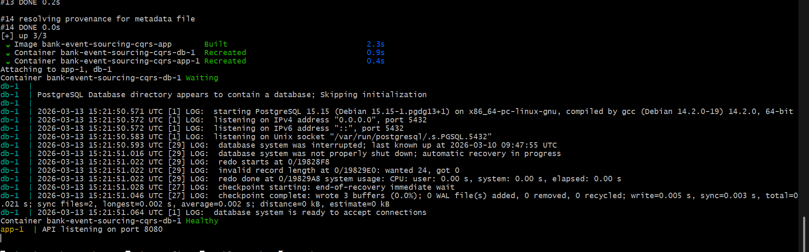
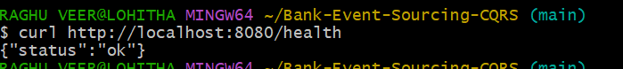
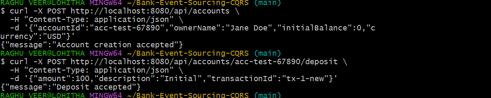
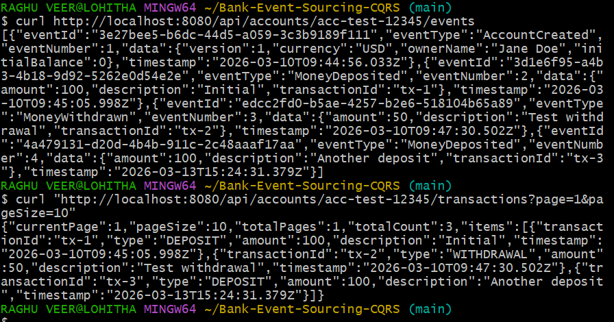

# Bank Event Sourcing & CQRS API

This project is a backend service for managing bank accounts using **Event Sourcing** and **CQRS (Command Query Responsibility Segregation)**.

Instead of storing only the latest state of an account, every action performed on an account is stored as an **event**. These events can later be replayed to rebuild the account state at any time.

This project was developed as part of the **Partnr Global Placement Program task**.

---

## What This Project Does

The system allows you to:

- Create bank accounts
- Deposit money
- Withdraw money
- Close accounts
- View account state
- View the full event history of an account
- View transaction history
- Rebuild projections from the event store

All account changes are stored as **immutable events**, which means the system always keeps a complete history of what happened.

---

## Tech Stack

- **Node.js**
- **TypeScript**
- **Express**
- **PostgreSQL**
- **Docker & Docker Compose**

Other small utilities used:
- `uuid`
- `dotenv`

---

## Architecture

This project follows **CQRS** and **Event Sourcing**.

### Write Side (Commands)
Commands are API requests that change the system state.

Examples:
- Create account
- Deposit money
- Withdraw money
- Close account

Each command generates an **event** that is stored in the `events` table.

### Read Side (Queries)

Instead of reading from the event store directly, the system maintains **projections** (read models).

These projections are stored in:
- `account_summaries`
- `transaction_history`

These tables are optimized for fast reads.

### Event Flow

1. API receives a command
2. Current account state is rebuilt from events
3. Business rules are validated
4. A new event is stored
5. Projections are updated

---

## Domain Events

The system currently supports four domain events:

- `AccountCreated`
- `MoneyDeposited`
- `MoneyWithdrawn`
- `AccountClosed`

Each event contains metadata and event data stored as JSON.

---

## Project Structure

```
├─ docker-compose.yml
├─ Dockerfile
├─ .env.example
├─ submission.json
├─ seeds
│  └─ 001_schema.sql
├─ src
│  ├─ index.ts
│  ├─ db.ts
│  ├─ types.ts
│  ├─ eventStore.ts
│  ├─ projections.ts
│  └─ accounts.ts
└─ README.md

```
---

## Running the Project

### 1. Clone the repository

```

git clone [https://github.com/lohithadamisetti123/Bank-Event-Sourcing-CQRS.git](https://github.com/lohithadamisetti123/Bank-Event-Sourcing-CQRS.git)
cd Bank-Event-Sourcing-CQRS

```

### 2. Create the environment file

```

cp .env.example .env

```

Example `.env`:

```

API_PORT=8080
DB_USER=bank_user
DB_PASSWORD=bank_password
DB_NAME=bank_db
DATABASE_URL=postgresql://bank_user:bank_password@db:5432/bank_db

```

### 3. Start the system

```

docker-compose up --build

```

This will start:

- PostgreSQL database
- Node.js API server

The API will be available at:

```

[http://localhost:8080](http://localhost:8080)

```

---

## Health Check

```

GET /health

````

Example response:

```json
{
  "status": "ok"
}
````

---

# API Endpoints

## Create Account

```
POST /api/accounts
```

Request body:

```json
{
  "accountId": "acc-test-12345",
  "ownerName": "Jane Doe",
  "initialBalance": 0,
  "currency": "USD"
}
```

---

## Deposit Money

```
POST /api/accounts/{accountId}/deposit
```

Example:

```json
{
  "amount": 100,
  "description": "Initial deposit",
  "transactionId": "tx-1"
}
```

---

## Withdraw Money

```
POST /api/accounts/{accountId}/withdraw
```

Example:

```json
{
  "amount": 50,
  "description": "ATM withdrawal",
  "transactionId": "tx-2"
}
```

---

## Close Account

```
POST /api/accounts/{accountId}/close
```

```json
{
  "reason": "User requested closure"
}
```

---

## Get Account Details

```
GET /api/accounts/{accountId}
```

Example response:

```json
{
  "accountId": "acc-test-12345",
  "ownerName": "Jane Doe",
  "balance": 100,
  "currency": "USD",
  "status": "OPEN"
}
```

---

## Get Account Event Stream

```
GET /api/accounts/{accountId}/events
```

Returns the complete event history for that account.

---

## Time Travel Balance

```
GET /api/accounts/{accountId}/balance-at/{timestamp}
```

This calculates the balance at a specific point in time by replaying events.

---

## Transaction History

```
GET /api/accounts/{accountId}/transactions?page=1&pageSize=10
```

Returns paginated transaction records.

---

## Rebuild Projections

```
POST /api/projections/rebuild
```

This will clear existing projections and rebuild them from the event store.

---

## Projection Status

```
GET /api/projections/status
```

Shows how up to date projections are compared to the event store.

---

## Snapshot Strategy

To improve performance, the system creates **snapshots** periodically.

After every **50 events**, a snapshot of the account state is stored.
When rebuilding state, the system loads the snapshot first and replays only newer events.

---

## Screenshots

### Docker Build Status


### API Health Check


### Account Creation


### Transactions


---

## Demo Video
Demo Video: https://your-video-link


---

## Manual Test Commands

Example `curl` commands:

Create account

```
curl -X POST http://localhost:8080/api/accounts \
-H "Content-Type: application/json" \
-d '{"accountId":"acc-test-12345","ownerName":"Jane Doe","initialBalance":0,"currency":"USD"}'
```

Deposit

```
curl -X POST http://localhost:8080/api/accounts/acc-test-12345/deposit \
-H "Content-Type: application/json" \
-d '{"amount":100,"description":"Initial","transactionId":"tx-1"}'
```

Withdraw

```
curl -X POST http://localhost:8080/api/accounts/acc-test-12345/withdraw \
-H "Content-Type: application/json" \
-d '{"amount":50,"description":"Test withdrawal","transactionId":"tx-2"}'
```

Get account state

```
curl http://localhost:8080/api/accounts/acc-test-12345
```

---

## Design Notes

* Projections are updated **synchronously** after each event.
* The architecture still allows moving projections to async processing later.
* Idempotency is supported using `transactionId`.
* The entire system runs with a **single Docker command**.
